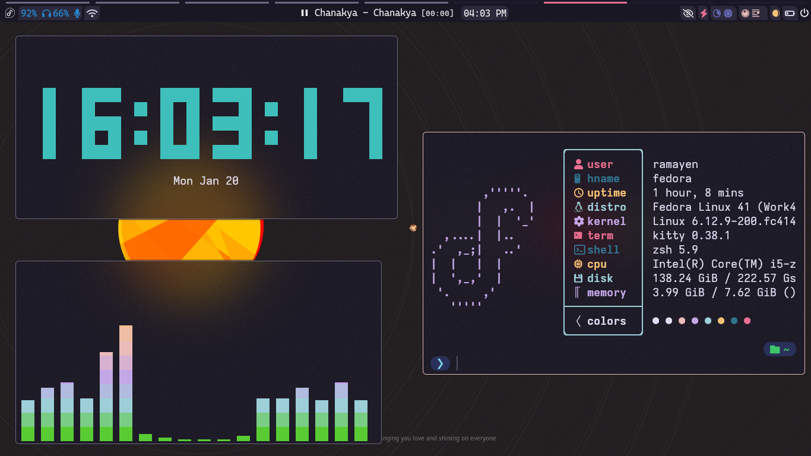
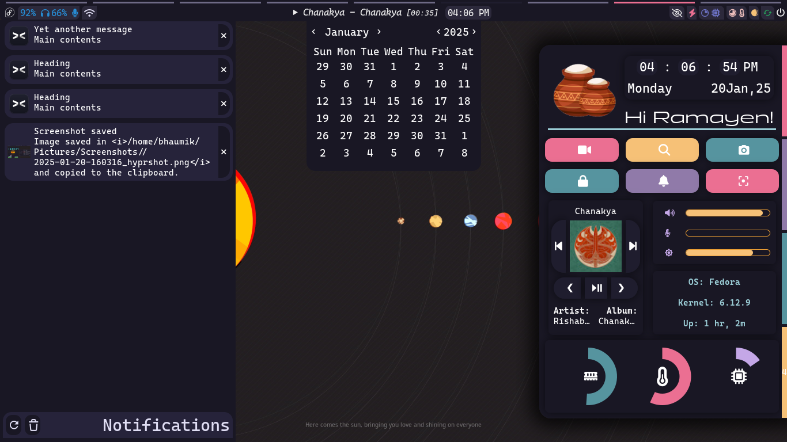

# Dotfiles

These are the dotfiles I have been using for the past few months as my daily driver, I must say it was fun
creating and using your on setup and dotfiles for the first time. It is fairly new and
immature repo. Maintained with the help of chezmoi(great project btw), you can learn more about the amazing
project [here](https://www.chezmoi.io).
> Disclaimer
These dotfiles are not made to work with every system. It is just a showcase of my configs, in case you find
something interesting, it can surely be adopted. Still, any suggestions are welcome. Feel free to open an issue.

## Utilities

| Description   | Tool          |
| ------------- | ------------- |
| Distro        | [Fedora](https://fedoraproject.org/)       |
| Wayland compositor  |   [Hyprland](https://hyprland.org/) |
| App Launcher | [Fuzzel](https://codeberg.org/dnkl/fuzzel)[^1] |
| Notification Daemon| [Dunst](https://dunst-project.org/) {[powernotd](https://lib.rs/crates/powernotd)}|
| Wallpaper Daemon | [hyprpaper](https://wiki.hyprland.org/Hypr-Ecosystem/hyprpaper/) with [paperizer](https://gitlab.com/imn1/paperizer) |
| Lock Screen | [Hyprlock](https://wiki.hyprland.org/Hypr-Ecosystem/hyprlock/)[^2] |
| Custom Widgets | [Eww](https://github.com/elkowar/eww) |
| Video Player| [VLC](https://www.videolan.org/) |
| Image Viewer | [Imv](https://sr.ht/~exec64/imv/) |
| Screenshot| [Hyprshot](https://github.com/Gustash/Hyprshot) |
| Shreen Recording | [OBS Studio](https://obsproject.com/) |
| Logout menu | [wlogout](https://github.com/ArtsyMacaw/wlogout) |
| Topbar | [waybar](https://github.com/Alexays/Waybar/) |
|Browser | [Zen](https://zen-browser.app/) with [nightTab](https://addons.mozilla.org/en-US/firefox/addon/nighttab/?utm_source=addons.mozilla.org&utm_medium=referral&utm_content=collection)|
|Terminal | [Kitty](https://sw.kovidgoyal.net/kitty/)|
| Shell | [zsh](https://zsh.sourceforge.io/) {[oh-my-posh](https://ohmyposh.dev/)/ [Antigen](https://github.com/zsh-users/antigen)}|
| Resource Monitor| [Btop](https://github.com/aristocratos/btop)|
|PDF Viewer | [Zathura](https://pwmt.org/projects/zathura/) |
|Text Editor | [Vim](https://www.vim.org/) |
|IDE| [Neovim](https://neovim.io/) |
|MPD client| [rmpc](https://mierak.github.io/rmpc/) |
| Filemanager | <ul><li><b>primary:</b> [ranger](https://github.com/ranger/ranger) </li><li><b>gui/secondary</b> [nautilus](https://apps.gnome.org/Nautilus/) </li></ul> |
| Email Client | <ul><li><b>primary:</b> [Neomutt](https://neomutt.org/)([notmuch](https://notmuchmail.org/))[^3] </li><li><b>gui/secondary</b> [Thunderbird](https://www.thunderbird.net/en-US/)[^4]</li></ul> |
| Fonts | <ul><li>Isovka</li><li>CaskaydiaCove</li><li>Panchang</li></ul> |

## Utilities archive

This list contains the utilities I like in general and consider them worth
mentioning along with my current in use utilities. These contains utilities
I have used in the past(marked with **P**), utilities I
have in my whishlist which I want to transition to slowly (marked with **W**) and 
utilities I like in General (marked with **G**).

| Description | Tool |
| ------------- | ------------- |
| Distro (**W**)        | Arch / InstantOS |
| App Launcher (**P**)| Rofi[^5]|
| Filemanager  (**G**)| <ul><li><b>Primary:</b> Superfile </li><li><b>GUI/Secondary</b> Thunar </li></ul>
| Video Player (**W**)| mpv player |
|Terminal (**P**)| Alacritty|
| Custom Widgets (**G**)| Chunks-rs |
|Browser (**W**)| qutebrowser|
| Video Player (**W**)| MPV |
| Image Viewer (**P**)| Feh |
|MPD client (**W**)| kew |
|Email Client  (**G**)| Aerc |
| IRC client (**W**)| Irssi |

## Showcase

These are a few images and a video of my configs in action. OBS Studio started causing some weird
behaviour, leading to high CPU hikes for the first time, hence the video became jerky. Will update that
for a better one as soon as I get some time.

## Use

Though you can definitely use the configs from [chezmoi](https://www.chezmoi.io/user-guide/daily-operations/#install-chezmoi-and-your-dotfiles-on-a-new-machine-with-a-single-command) commands. I highly recommend against it.
These configs are bound to work with my laptop screen size, hence various values and paths are
hard coded in the files. Also, I havn't created any installation scripts. So, breaking is bound to happen. Alternatively, you can copy
files of specific utilities you want to use.

## Important Points
Few of "design decisions" which might seem different to others is due to following reasons.
1. This config is used by me on my laptop, hence a concurrent absence of spacing and floating
topbar is eminent for saving space.
2. The config doesn't do anything more than making hyprland look descent and workable.
3. I still don't use half of the utilities I will mention at their full keyboard configs, hence these
are underutilised, as they will fit more in my muscle memory, I shall add more keybinds for them.
4. The config doesn't try to rice apps, at least for now. I will eventually add them but after all the
above checkboxes are met, I might add app rices too, and 2-3 more themes with wallust just so that my eyes
don't get tired of seeing Rose Piné.

---
## Footnotes

[^1]: Credit to [networkmanager_dmenu](https://github.com/firecat53/networkmanager-dmenu) for making network management
easy and go to task with fuzzel.
[^2]: [Hyprlock dots](https://github.com/mahaveergurjar/Hyprlock-Dots) helped me a lot before I made my own 3 layouts (The last three in layouts folder).
Hence, the scripts are still here even though I don't use it. Good For beginners.
[^3]: These two articles ( [1](https://gideonwolfe.com/posts/workflow/neomutt/intro/), [2](https://www.jevy.org/articles/neomutt-lieer-notmuch/)) were a godsend for setting Neomutt and gmail in it.
[^4]: Using thunderbird with external-editor plugin and html wrapping disables
works best for mailing lists.
[^5]: Rofi was very good for quick starting with hyprland, Rofi themes by [this](https://github.com/adi1090x/rofi) repo
is the best place I can recommend for new commers.
